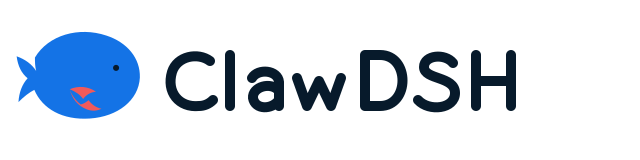

# ClawDSH 品牌指南

[English](README.md) | 中文



ClawDSH 使用“潮汐钳鲸”图形：一只平静的鲸鱼把小型珊瑚色钳子作为胸鳍。鲸鱼代表 dsh 底盘与长时间运行的 Agent 工作，钳子代表 ClawDSH 重建的可组合个人助手能力。鲸鱼始终是视觉主体。

ClawDSH 是构建于 DeepSeek Harness 并与 OpenClaw 互操作的独立社区项目。其图形为原创设计，不得暗示任一上游项目为 ClawDSH 背书。

## 语言风格

英文定位语是“OpenClaw capabilities, rebuilt as composable dsh plugins.”，中文定位语是“把 OpenClaw 的个人助手能力，重建为可组合、可维护的 dsh 插件。”产品文案应当平静、直接、技术含义准确，并如实说明能力状态。

## 主资产

| 资产 | 用途 |
| --- | --- |
| `clawdsh-mark.svg` | 用于透明的浅色或中性色表面的默认全彩图形 |
| `clawdsh-lockup.svg` | 用于文档和宽布局的图形与路径化字标组合 |
| `clawdsh-monochrome.svg` | 用于受限复制场景的单色图形 |
| `clawdsh-maskable.svg` | 带固定 Foam 底色和安全留白的应用图标 |
| `clawdsh-social-preview.png` | 1280×640 仓库及链接预览图 |

不要改变比例、单独改色、增加渐变或阴影、旋转图形，也不要拆下珊瑚色胸鳍。图形四周的最小净空等于眼睛到鲸头的距离。小于 24 CSS pixel 时只使用图形，不使用组合字标。

## 色板

| Token | Hex | 用途 |
| --- | --- | --- |
| Deep Ocean | `#071A2B` | 字标、深色表面及高对比细节 |
| Tidal Blue | `#1473E6` | 鲸鱼主体及主要交互强调色 |
| Coral Claw | `#F05A5B` | 只用于钳子和装饰性强调 |
| Foam | `#F4FAFF` | 浅色表面及反白图形 |

Coral Claw 只用于装饰。不要把它用作产品错误色，也不要让它成为状态的唯一信号。文字与控件必须在实际 UI 上下文中满足 WCAG AA 对比度要求。

## 无障碍与动效

当图形是唯一产品标签时，提供无障碍名称“ClawDSH”；相邻文字已经写明产品名时，使用空替代文本。不得用图形表达能力状态。品牌动效是可选的，只能轻微呈现，并且必须响应 `prefers-reduced-motion`。

## 生产方式

SVG 文件只包含 path 与基础几何图形，不包含字体、外部引用、嵌入位图、渐变、filter、script 或生成器元数据。使用下列命令重新生成检入的 PNG 衍生资产与 Web 镜像：

```bash
node tools/render-clawdsh-brand.mjs
node tools/render-clawdsh-brand.mjs --check
```

生成式概念图只用于评估视觉主体层级。检入的矢量图由基本几何重新绘制，是唯一事实来源。
